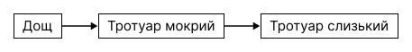
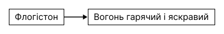

# Вигадана причиновість

Відповіддю алхіміків вісімнадцятого століття на стихію вогню, запроваджену давніми греками, був флогістон. Запалюєте деревину і дивитеся, як вона горить. А потім питаєте: що це за жовтогаряча полум’яна штукенція? Чому дерево обертається на попіл? Обидва питання тогочасні хіміки закривали однією відповіддю — флогістон.

Йойки, розумієте? Їхньою відповіддю був... флогістон.

У процесі горіння флогістон вивільнявся у вигляді видимого полум’я. З виділенням флогістону горючі речовини втрачали його й оберталися у попіл — «чисту субстанцію». А в закритих посудинах полум’я згасало, бо повітря перенасичувалося флогістоном, що унеможливлювало подальше горіння. Опісля згоряння від деревного вугілля майже нічого не залишалося, тому що вугілля — майже чистий флогістон.

Але ніхто, звісно, не застосовував теорію флогістону, щоб _передбачити_ результат хімічної реакції. Спочатку ви дивилися на результат, а теорією флогістону _пояснювали_ його. Теоретики флогістону не прогнозували, що у закритій посудині полум’я згасне, — вони запалювали полум’я у посудині, дивилися, як воно потухає, а тоді казали: «Повітря перенасичилося флогістоном». Теорія не годилася для того, щоб вказати на те, які результати були б *неможливими*, якби вона була правильною. Нею можна було випояснити що завгодно.

Такими були перші кроки науки. Довгий час нікому й на думку не спадало, що це було проблемою. Вигадані пояснення _виглядають_ правдоподібними. І цим вони небезпечні.

Згідно із сучасними дослідженнями, люди думають про причиново-наслідковий зв’язок як про орієнтовані ациклічні графи (ОАГ) мереж Баєса. Оскільки дощило, тротуар мокрий; оскільки тротуар мокрий, він слизький.

З цього ми можемо виснувати (або, з позиції мереж Баєса, строго розрахувати в імовірностях), що якщо тротуар слизький, то, мабуть, дощило. Та якщо нам уже відомо, що тротуар мокрий, то, дізнавшись, що він іще й слизький, ми не можемо нічого сказати про те, чи дощило.

Чому під час горіння вогонь гарячий і яскравий?

_Схоже_ на пояснення, _представлене_ у тому ж форматі когнітивних даних. Проте людський мозок не завжди розпізнає, коли причина не обмежує наслідок. Ба навіть гірше, через ефект знання заднім числом може скластися враження, що причина обмежує наслідок, тоді як вона просто підлаштовується під нього.

Показово, що на основі нашого сучасного розуміння ймовірнісного міркування про причиновість ми можемо з точністю описати, що теоретики флогістону робили не так. Одним зі стимулів для створення баєсових мереж була проблема подвійного підрахунку свідчень, коли висновок перегукується з наслідком і причиною. Скажімо, я отримую не зовсім надійну інформацію про те, що тротуар мокрий. І в мене виникає думка, що, скоріше за все, зараз дощить. А якщо, скоріше за все, зараз дощить, чи не збільшує це ймовірність того, що тротуар мокрий? І чи не збільшує _це_ ймовірність того, що тротуар слизький? Але якщо тротуар слизький, він, можливо, і мокрий, а тоді мені знову потрібно буде підвищити ймовірність того, що зараз іде дощ...

Джу́да Перл використовує метафору про алгоритм для підрахунку кількості солдат у строю. Припустімо, ви стоїте у строю: один солдат попереду, один позаду. Усього їх троє (разом з вами). Ви питаєте солдата позаду: «Скільки солдатів _ти_ бачиш?» Оглядається і відповідає: «Троє». Тепер усього — шестеро. Очевидно, це слід робити _не_ так.

Розумнішим було б запитати солдата попереду «Скільки солдатів перед тобою?», а солдата позаду — «Скільки солдатів позаду тебе?» Направду, можна було поставити питання «Скільки солдатів попереду?» і не спровокувати плутанину. Якщо стрій починається мною, я передаю сигнал: «Один солдат попереду». Той, хто позаду, отримує «один солдат попереду» і передає «двоє солдатів попереду» тому, хто позаду. Водночас кожен солдат отримує повідомлення «N солдатів позаду» від тих, хто стоїть позаду, передаючи його далі у вигляді «N + 1 солдатів позаду» тому, хто стоїть попереду. То скільки тих солдатів усього? Додайте два отримані числа і ще одиницю — ось вам загальна кількість солдатів у строю.

Суть у тому, що кожен солдат має _окремо_ вести лік своїх обрахунків — чи то позаду, чи то попереду — і вже тільки насамкінець додати обидва. Не варто додавати солдатів, про яких ви дізналися ззаду, до тих, про яких ви дізналися спереду. Ніхто не передає і не озвучує вголос загальну кількість солдатів.

Аналогічний принцип діє у строгому варіанті ймовірнісного міркування про причиновість. Якщо ви дізнаєтеся про те, що йде дощ з якогось _іншого_ джерела, а не зі спостереження мокрого тротуару, це спровокує переадресацію повідомлення від \[Дощ\] до \[Тротуар мокрий\]. Це підвищить очікування того, що тротуар мокрий. Якщо ви бачите, що тротуар мокрий, це спровокує зворотний сигнал до нашого переконання про те, що зараз іде дощ. І це повідомлення розповсюджується від \[Дощ\] до всіх сусідніх вузлів, _окрім_ вузла \[Тротуар мокрий\]. Ми зараховуємо кожне свідчення рівно один раз. Жодне оновлене повідомлення не «стрибає» туди-сюди. Точний опис цього алгоритму можна знайти у книзі Джуди Перла «[Імовірнісне міркування у системах інтелекту: мережа вірогідних висновків».](https://books.google.com/books?id=k9VsqN24pNYC&dq=&pg=PP1&ots=WR9UGWdOdd&sig=w_Mrax-y4VVwZy5SQGySphNsKMc&prev=http://www.google.com/search?hl=en&safe=off&q=pearl+intelligent+systems&btnG=Search&sa=X&oi=print&ct=title#PPA143,M1)[^1]
[^1]: Judea Pearl, *Probabilistic Reasoning in Intelligent Systems: Networks of Plausible Inference* (San Mateo, CA: Morgan Kaufmann, 1988).

То що ж пішло не так у теорії флогістону? Коли ми дізнаємося, що вогонь гарячий, вузол \[Вогонь гарячий і яскравий\] може передати свідчення у зворотному напрямку до вузла \[Флогістон\], що спонукає нас оновити свої уявлення про флогістон. Але в такому разі ми не зможемо зарахувати таке міркування до вдалого передбачення флогістонової теорії. Це повідомлення має прямувати тільки в один бік і не стрибати назад.

Але, на жаль, люди не послуговуються строгим алгоритмом для оновлення мереж переконань. Ми дізнаємося про батьківський вузол (джерело) зі спостережень про дочірній і передбачаємо дані про дочірні вузли з наших уявлень про батьківський. Але ми не проводимо строгого розмежування між записами для напрямків назад і вперед. Ми запам’ятовуємо собі, що флогістон гарячий, тому він _є причиною_ того жару у вогні. Що ж, схоже, флогістоновою теорією можна передбачити вогняний жар. Чи, гірше того, виникає враження, що _флогістон є причиною того жару_.

Поки ви не помічаєте ніяких завчасних прогнозів, ви не називаєте необмежений причиновий вузол «вигаданим». Він представлений так само, як і будь-який інший вузол у вашій мережі переконань. Він сприймається як факт, як і всі інші відомі вам факти: _через флогістон вогонь гарячий_.

Правильно спроєктований ШІ миттєво помітив би цю проблему. Не потрібен навіть спеціальний код — достатньо правильного обліку мережі переконань. (На жаль, ми, люди, не можемо перепрограмувати себе так, як міг би правильно спроєктований ШІ).

Ефект знання заднім числом — простий нетехнічний спосіб сказати, що люди не проводять строгого розмежування між прямими і зворотними повідомленнями, через що перші забруднюються другими.

Ті, хто багато років тому пішов шляхом флогістону, не з власної волі пошилися в дурні. Науковці не настільки йолопи, щоб навмисне загнати самих себе у сліпий кут. А у _вас_ є вигадані пояснення? Коли такі є, певен, що ви не називаєте їх «вигаданими поясненнями», тому за ключовим словом «вигаданий» ваша ментальна база даних жодних результатів вам не видасть.

Через ефект знання заднім числом уже замало перевірити, наскільки вдало ваша теорія передбачає наявні дані. Якщо спираєтеся на «вчора», ви позбавляєте себе гарантії, що безладний людський розум надішле незабруднене пряме повідомлення. Тому й наполягаю, що завбачати треба «завтра».