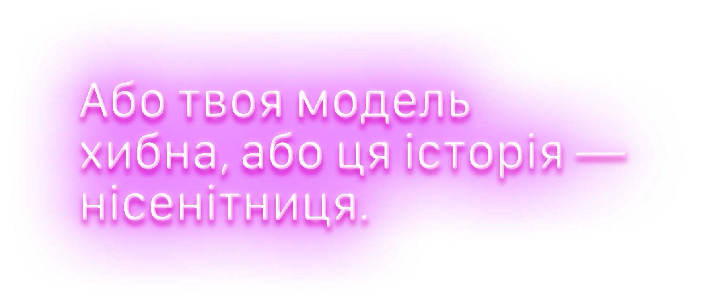

## Сила раціоналіста

Ще за царя Гороха, коли я спілкувався у тематичних чатах, мене спіткав ось такий трапунок. З часом спогади про цю подію дещо потьмяніли, тому мій виклад може бути неточним.

Отже, якось у чаті я натрапив на чиєсь повідомлення про те, що товариш автора цього повідомлення потребує фахової поради лікаря. За словами друга, у нього раптово заболіло у грудях, і він викликав карету швидкої допомоги. По приїзду парамедики відказали, що нема чого хвилюватися, і поїхали. Але біль у грудях так і не вщух і, навпаки, тільки загострився. Що ж робити його другові?

Ця історія мене спантеличила. Я пригадав, як читав про безпритульних у Нью-Йорку. Вони викликали швидку, щоб їх просто забрали у якесь тепле місце, і парамедики не мали права не доставити їх до відділення невідкладної допомоги. Навіть у двадцять сьомий раз. Бо якщо вони відмовлять, то на клініку, яка надає послуги швидкої медичної допомоги, можуть подати позов до суду і стягнути чималі гроші. Так само працівники відділення швидкої медичної допомоги за законом зобов’язані надавати допомогу усім, навіть якщо дехто не може за неї заплатити.[^1] Тому мені було не до кінця ясно, як таке могло статися. Усякого, хто повідомляв про раптовий біль у грудях, мала б негайно забрати швидка.
[^1]: І клініка витрачає на це величезні кошти, тому відділення швидкої допомоги закриваються... Це наводить на думку, що економісти, виходить, нам і не потрібні, якщо ми просто нехтуємо їхніми знаннями. — Прим. авт.

І на цьому випадку я дав маху як раціоналіст. Я пригадав, як лікар не поспішав хвилюватися, коли я повідомив про схожі симптоми, які здалися мені вкрай тривожними. І лікарі завжди мали рацію. Жодного разу не схибили. Одного дня у мене самого заболіло у грудях, і лікар спокійно пояснив, що я описую не серцевий напад, а біль у грудних м’язах. Тож я написав у тому чаті: «Що ж, якщо парамедики сказали вашому другові, що хвилюватися не варто, то, треба гадати, _так і є_ — інакше його б забрали, якби був бодай найменший ризик чогось серйозного».

Ось так я пояснив собі всю цю історію в рамках моєї теперішньої моделі, хоча все одно відчувався деякий примус із узгодженням…

Опісля автор повідомлення повернувся до чату і написав, що його друг вигадав історію від початку до кінця. Вочевидь, не найнадійніший друг.

Гадаю, я мав би зрозуміти, що невідомий знайомий знайомого в Інтернеті — не таке вже надійне джерело інформації, на відміну від статті, надрукованої в журналі. На жаль, прийняти твердження за істину куди легше, ніж не прийняти — віра інстинктивна, а невіра потребує свідомих зусиль.[^2]
[^2]: З публікації McCluskey (2007), “Truth Bias”: «\[Л\]юдям краще вдається ідентифіковувати правдиві твердження порівняно з брехливими. Такий висновок виглядає досить надійним, оскільки він не є просто функцією правди на основі правильної здогадки, коли свідчення слабкі, адже він проявляється у контрольованих умовах експериментів, в яких суб’єкти мають вагомі причини не припускати правди». [https://www.overcomingbias.com/p/truth-biashtml](https://www.overcomingbias.com/p/truth-biashtml) Із публікації Gilbert et al. (1993), “You Can’t Not Believe Everything You Read”: «Чи можуть люди розуміти твердження, не вірячи у них? \[...\] Три експерименти свідчать на користь гіпотези про те, що розуміння передбачає певну початкову віру в інформацію, яку намагаємося осягнути». — Прим. авт.

Тож насправді я доклав величезних зусиль, змусивши свою модель реальності пояснити аномалію, якої _ніколи й не ставалося_. І я _знав_, наскільки ганебним це було. _Знав_, що корисність моделі полягає не в тому, що вона може пояснити, а в тому, чого вона пояснити не може. Гіпотеза, яка нічого не забороняє, дозволяє будь-що, а отже, ніяк не обмежує очікування.

Сила раціоналіста полягає у здатності спантеличуватися при взаємодії з вигадкою, а не з дійсністю. Якщо ви неабиякий мастак із пояснення чого завгодно, то у вас нульове знання.

Усі ми буваємо слабкі час від часу. Та найприкріше те, що я _міг_ бути розсудливішим. У мене була вся необхідна інформація, щоб дійти правильної відповіді. Я навіть _помітив_ проблему. А потім знехтував нею. Моє відчуття спантеличеності мало би правити мені за свідчення, та я викинув цю зачіпку.

Я мав би бути уважнішим до того, що те відчуття спокою _було злегка натягнутим_. Це те відчуття, яке шукач істини має цінувати, це — частина вашої сили раціоналіста. Недолік конструкції людського мислення полягає в тому, що описане відчуття проявляється у вигляді ледь помітного напруження на задвірках вашої свідомості, а не виття тривоги та сяйва неонової вивіски:

