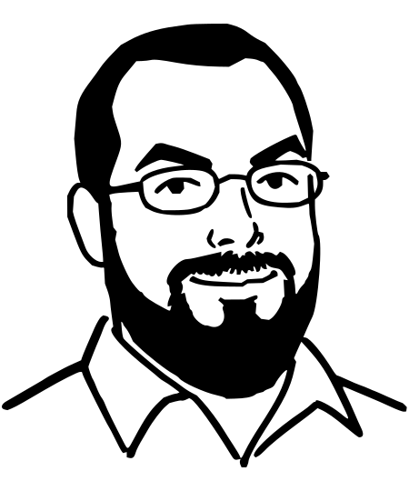
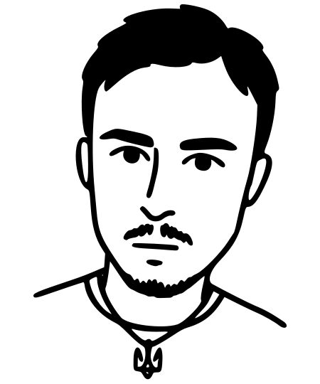
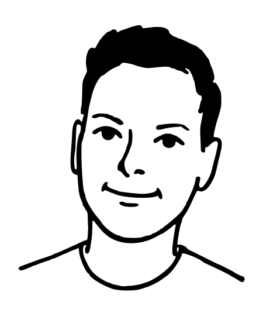

<strong>Rationality: from AI to Zombies — Eliezer Yudkowski</strong>

Вперше опубліковано як записи у блогах Overcoming Bias та Less Wrong, з 2006-го по 2009-й рік.

Цей переклад — фанатський проєкт, що створюється з 2023-го року, з люб'язного дозволу авторів. Не для продажу. Не для комерційного використання. Всі права на оригінальний твір належать Елієзеру Юдковскі

<strong>Від перекладача — Данила Жирка</strong>

Красно дякую друзям зі спільноти pre post, які терпляче і вичерпно роз'яснювали складні моменти у книзі щоразу, коли я цього потребував. Завдяки вам у перекладі куди менше помилок.

<strong>Від дизайнера — Дениса Лук'яненка</strong>

Долучитися до перекладу, вказати на помилку або просто подивитись, як все влаштовано можна на GitHub: <a href="https://github.com/DanTheStrongworded/rationality-ua-public" target="_blank">DanTheStrongworded/rationality-ua-public</a>

<strong>Зверстано у Сторінкаторі {{STORINKATOR_VERSION}} – <a href="https://github.com/denlukia/storinkator" target="_blank">denlukia/storinkator</a></strong>

Гарнітури: {{STORINKATOR_USED_FONTS}}.

Версія перекладу {{TRANSLATION_VERSION}} · {{TRANSLATION_DATE}}

