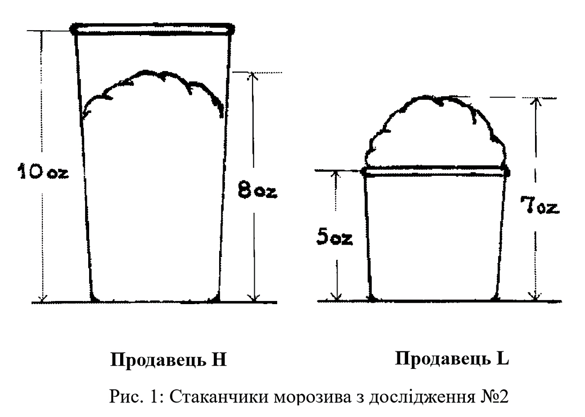

## Оціне́нність (та дешеві покупки на свята)

Наближається період свят, тож я ніяк не можу обійти увагою питання від читачів:

> «Шановна редакціє _Overcoming Bias_, чи є якесь упередження, яке я міг би використати, щоб про мене склали *враження* щедрої людини, але я при цьому не дарував *нічого дорогого*?».

Радо відповідаю: і такі упередження існують! Як пише Ші у своїй статті «Менше — краще», якщо ви придбаєте шарф за 45 доларів, в очах отримувача ви, ймовірніше, постанете щедрою людиною, ніж якщо купите пальто за 55 доларів.[^1]
[^1]: Christopher K. Hsee, “Less Is Better: When Low-Value Options Are Valued More Highly than High-Value Options,” _Behavioral Decision Making_ 11 (2 1998): 107–121.

Це окремий випадок більш загального явища. До цього Ші ставив піддослідним питання, скільки вони готові заплатити за вживаний словник музичних термінів:[^2]
[^2]: Christopher K. Hsee, “The Evaluability Hypothesis: An Explanation for Preference Reversals between Joint and Separate Evaluations of Alternatives,” _Organizational Behavior and Human Decision Processes_ 67 (3 1996): 247–257.

*   Словник А 1993 року випуску містить 10 000 статей — стан як новий.
*   Словник Б 1993 року випуску містить 20 000 статей, обкладинка порвана, решта ціла і як нова.

Заковика у тому, що деякі піддослідні бачили два словники, а інші — тільки _один_...

Піддослідні, яким давали _один_ з варіантів, були готові заплатити в середньому 24 долари за Словник А і в середньому 20 доларів за Словник Б. Учасники, яким давали одразу _обидва_, були готові заплатити 27 доларів за Словник Б і 19 доларів за Словник А.

Звісно, кількість статей у словнику відіграє більшу роль за якість обкладинки (принаймні якщо ви збираєтеся ним користуватися). Але якщо вам показують тільки один словник, і в ньому 20 000 статей, то це число не несе багато інформації. Це мало? Багато? Хтозна. _Ні з чим порівняти_. З іншої сторони, один зі словників виділяється розірваною обкладинкою. Ця характеристика має негативну емоційну зарядженість.

Однак якщо оцінювати словники, що лежать поряд, кількість статей стає *оцінюваною* — з’являються дві *зіставні* величини. І щойно цей параметр стає оцінюваним, він починає переважати над тим, чи важлива пошарпана обкладинка.

В експерименті Словіка ставили інше питання. Що ви оберете?[^3]
[^3]: Slovic et al., “Rational Actors or Rational Fools.”

1. Шанс 29/36 виграти $2.
2. Шанс 7/36 виграти $9.

Тоді як середні _ціни_ цих пропозицій, в еквівалентній вартості, становили 1,25 долара та 2,11 долара, їхні середні рейтинги привабливості складали 13,2 та 7,5 відповідно. І ціни, і рейтинги привабливості отримували в умовах, коли учасникам повідомляли, що з уже оцінених азартних ігор навмання оберуть дві, і вони зіграють у ту, яка має вищу ціну або вищий рейтинг привабливості. (У піддослідних була мотивація оцінювати вище і виставляти вищу ціну за ті ігри, в які вони хотіли зіграти.)

Азартна гра з вищим грошовим виграшем здавалася менш привабливою — класичний випадок обернення вподобань. Дослідники припустили, що грошові суми більше узгоджуються із завданням оцінювання ціни, тоді як імовірність виграшу — із привабливістю. Тому дослідники вирішили зробити виграш у грі більш емоційно виразним — афективно оцінюваним — більш привабливим.

Невеликий програш вони зробили частиною гри. У старій версії гри виграєте 9 доларів із шансом 7/36. У новій версії можна виграти 9 доларів з імовірністю 7/36 і втратити 5 центів з імовірністю 29/36. Зголошуючись на стару версію, ви відразу оцінюєте привабливість 9 доларів. А в новій грі порівнюєте бажаний виграш у 9 доларів _з утратою_ 5 центів.

У статті автори зазначили: «Результати перевищили наші очікування». У новому експерименті проста гра із шансом 7/36 виграти 9 доларів отримала середній рейтинг привабливості у 9,4 бала, тоді як версія із шансом 29/36 програти 5 центів — рейтинг у 14,9 бала.

У подальшому експерименті тестували, чи учасники експерименту обирали стару версію або гарантований прибуток у 2 долари. Тільки 33% студентів віддали перевагу старій грі. В іншій групі попросили обрати між гарантованими 2 доларами та новою грою (з доданою ймовірністю втратити 5 центів). 60,8% респондентів віддали перевагу цій грі. Хай там як, а 9 доларів не вельми приваблива сума, а от виграти 9 доларів чи програти п’ять центів — _неймовірно_ привабливе співвідношення виграшу до програшу.

Одним лише збитком можна зробити гру більш привабливою. Така вона — людська психологія. Тому-то хто розуміє витончену складність людського інтелекту, не хоче схожості штучного інтелекту на людський.

Звісно, що такий трюк спрацює, коли немає можливості порівняти дві гри.

_Два стаканчики морозива з дослідження Ші © 1998 John Wiley & Sons, Ltd (Джон Ва́йлі та сини)._

Як думаєте, якому з двох стаканчиків морозива на Рисунку 1 учасники схожого експерименту Крістофера Ші надали перевагу?

Як і годиться, відповідь залежить від того, чи піддослідні бачили один стаканчик чи одразу обидва. Піддослідні, яким показали один стаканчик, були готові заплатити 1,66 долара Продавцю H та 2,26 долара Продавцю L, тоді як хто бачив обидва стаканчики, був готовий віддати 1,85 долара Продавцю H та 1,56 долара Продавцю L.

Що з цього ми можемо винести, коли підемо купляти подарунки? Якщо ви вивернете гаманця на 400 доларів на айПо́д Та́ч із 16 Гб, адресат подарунка побачить найдорожчий MP3-плеєр. Заплатите 400 доларів за Нінте́ндо Ві — адресат подарунка побачить найдешевшу гральну консоль. Тож яке співвідношення ціни та цінності вигідніше? Це питання набуває сенсу, коли можна порівняти один товар з іншим. І цей привілей буде тільки у _вас_ — адресат бачитиме тільки ваш вибір.

Якщо у вашому розпорядженні обмежена сума грошей, а ваша мета — показати свою дружбу і не обов’язково _допомогти_ адресату, не купуйте цінні речі. Подумайте, скільки ви готові віддати за те, щоб справити враження на отримувача, а потім знайдіть найменш цінну річ, яка коштує стільки ж. Що дешевший _клас_ речей, то більш по-багатому ця _річ_ виглядатиме — ви ж витратили на неї фіксовану суму. Який із подарунків запам’ятається надовго — футболка за 25 доларів чи свічка за ті ж гроші?

І ось, дивіться, японський звичай купувати дині за 50 доларів уже набуває нового сенсу. А ви, либонь, дивилися на тих японців і хитали головою: «Це ж що там у них у голові?». І все ж їх вважають надзвичайно щедрими, аж до марнотратства, хоча платять вони за свою щедрість 50 доларів. Ви можете заплатити за вишукану вечерю 200 доларів, так і не заживши слави багатія, а можете купити диню за 50 доларів. А якби існував звичай дарувати зубочистки за 25 доларів чи порошинки за 10 доларів, то примудрялися б витрачати ще менше.

P.S. Розкажете, що купили, якщо трюк таки стане у пригоді?
