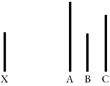

## Експеримент А́ша

Завдяки експериментам, які почали проводити у 50-х роках XX ст. і згодом неодноразово відтворили, Соломон Аш привернув увагу до явища, відомого як конформність, або піддатливість. У класичному варіанті піддослідному пропонують завдання, подібне до того, що показано на рисунку нижче. Котрий з відрізків — A, B чи C — має таку саму довжину, що й відрізок X? Зупиніться трохи на подумати…

Піддослідний сидів поряд з іншими людьми, які так само розглядали рисунок. Але цими людьми були не інші піддослідні, як ви могли подумати, а співучасники експериментатора. У цьому й заковика. Підставні учасники одне за одним відповідали, що відрізок C тієї ж довжини, що й відрізок X. Справжній піддослідний сидить передостаннім. Скільки піддослідних теж відповіли C, себто дали очевидно хибну відповідь, яка збігалася з одностайною відповіддю решти групи? Як гадаєте, який відсоток?

У ході експерименту Аша три чверті піддослідних хоча б раз дали відповідь, що узгоджувалася із груповою. Третина підлаштовувалася під відповідь інших у більш ніж половині випадків.

Після експерименту піддослідних опитали і дізналися, що більшість насправді не вірила у групові відповіді, хоча деякі все ж казали, що дійсно вважали поширену відповідь правильною.

Результати стурбували Аша:[^1]
[^1]: Solomon E. Asch, “Studies of Independence and Conformity: A Minority of One Against a Unanimous Majority,” _Psychological Monographs_ 70 (1956).

> «Як з’ясувалося, схильність до конформної поведінки в нашому суспільстві виявилася надзвичайно сильною… Чи є це приводом для хвилювань? Постали питання і про наші методи навчання та цінності, що керують нашою поведінкою».

Питання про те, наскільки _ірраціональною_ була поведінка піддослідних в експерименті Аша, геть не тривіальне. Згідно з теоремою Роберта А́уманна про згоду, чесні баєсіанці не можуть лишатися кожен при своїй думці: якщо їхні оцінки ймовірності ґрунтуються на спільному знанні, вони зрештою мають збігатися. Більше ніж за два десятиліття після експериментів Аша було доведено теорему Ауманна, яка лише формалізує та підкріплює інтуїтивно зрозумілу думку: переконання інших людей часто слугують надійним свідченням.

Ось ви дивитеся на рисунок і _точно_ знаєте, що інші учасники, маючи перед очима той самий рисунок, говорять правду про однакові довжини відрізків C та X. Які взагалі шанси, що _саме_ ви пра́ві? Не думаю, що я чимось кращий у _наочно-образному_ мисленні за середньостатистичну людину, яка на око може порівняти два відрізки. З погляду особистої раціональності, сподіваюся, що зміг би вловити момент власного спантеличення — і тоді надав би відповіді більшості ймовірність, більшу за 50%.

З погляду групової раціональності, як на мене, чесний раціоналіст має відреагувати якось так: «Дивно, бо мені _здається_, що це відрізок B тієї ж довжини, що й відрізок X. Але якщо ми дивимось на той самий рисунок і відповідаємо чесно, то я не можу сказати, що моє судження правильніше за твоє». Останнє речення важливе, хоч і слабше заявляє про незгоду, ніж «А, тепер зрозуміло! Тут оптична ілюзія — _я_ зрозумів, чому ти обрав C, але насправді правильна відповідь все ж таки B».

Тепер піддослідних, які підлаштувалися під групову відповідь, назвати ірраціональними вже _важче_. Правда ж? Адже чорт ховається у подробицях результатів експерименту. Род Бонд та Пітер Сміт провели метааналіз із понад сотнею відтворень . . . [^2]
[^2]: Rod Bond and Peter B. Smith, “Culture and Conformity: A Meta-Analysis of Studies Using Asch’s (1952b, 1956) Line Judgment Task,” _Psychological Bulletin_ 119 (1996): 111–137.

. . . Згідно з його результатами, рівень конформності зростає, коли в експерименті беруть участь до трьох підставних учасників, але далі, до десяти-п’ятнадцяти «піддослідних», динаміка виходить на плато. Якщо люди піддаються впливу раціонально, тоді відповідь п’ятнадцяти інших піддослідних мусить бути переконливішим свідченням за відповідь трьох.

Якщо додати хоча б одного інакодумця, який дасть правильну чи неправильну, але відмінну від групової відповідь, вплив конформності різко знижується до 5-10% піддослідних. Якщо ви застосовуєте інтуїтивну версію теореми Ауманна — де незгода однієї людини з трьома вказує на правоту трьох — то в більшості випадків слід бути так само готовими прийняти, що двоє не погоджуватимуться з шістьома.[^3] З іншого боку, якщо в групі є люди, які переживають через свій статус білої ворони, то не дивно, що коли на ваш бік стане ще одна людина або хтось, хто не погоджується з рештою, ви почуєтеся менш знервованими.
[^3]: Порівняння не свідчить про правдивість когось напряму́, та воно правдиве за інших рівних умов. — Прим. авт.

Не дивно, що піддослідні у ситуації одного інакодумця не знали, що на їхній спротив конформності повпливав саме він. Як і 90% водіїв, які вважають, що водять краще за середньостатистичних, деякі з них дійсно мають рацію. Люди не усвідомлюють причин своєї піддатливості впливу чи незгоди, що ускладнює аргументацію на користь раціональності механізмів конформної поведінки.[^4]
[^4]: Наприклад, якщо виходити з припущення, що люди з соціально-раціональних міркувань вирішують брехати, аби не вирізнятися, — виявляється, що (принаймні деякі) піддослідні в умові з одним інакодумцем свідомо не передбачають тієї «свідомої стратегії», яку б застосували, зіткнувшись з одностайною опозицією. — Прим. авт.

Коли ж єдиний інакодумець раптово *підлаштовується під групу*, рівень конформності піддослідних повертається до такого ж високого, як і за умови без нього. Тому виступати першим незгодним — цінна (і дорога!) соціальна послуга, але її треба витримувати до кінця.

Крім того, впродовж експериментів жінки-учасниці (як справжні, так і підставні) послідовно демонстрували значно вищий рівень конформності, ніж чоловіча частина. Близько половини жінок у групі погоджувалися з рештою у більш ніж половині випадків порівняно з третиною чоловіків. Отже, якщо ви стверджуєте, що середньостатистичний піддослідний поводиться раціонально, то жінки, очевидно, надто часто погоджуються, а чоловіки — забагато сперечаються, тож жодна група не є по-справжньому _раціональною_.

Маніпуляції з поділом «свої-чужі» (наприклад, піддослідний з вадами серед інших піддослідних з вадами) так само показують, що рівень конформності значно вищий серед членів своєї групи.

Конформність нижча у випадку очевидних діаграм — як та, що на початку есею — ніж у випадку діаграм із менш помітними помилками. Це спостереження важко пояснити, якщо (всі) піддослідні ухвалюють соціально раціональне рішення не виділятися.

І насамкінець Пол Кро́улі звертає увагу на цікавий момент: коли відповіді піддослідних анонімні всередині групи, рівень конформності теж падає. І такий погляд суперечить Ауманновій інтерпретації.